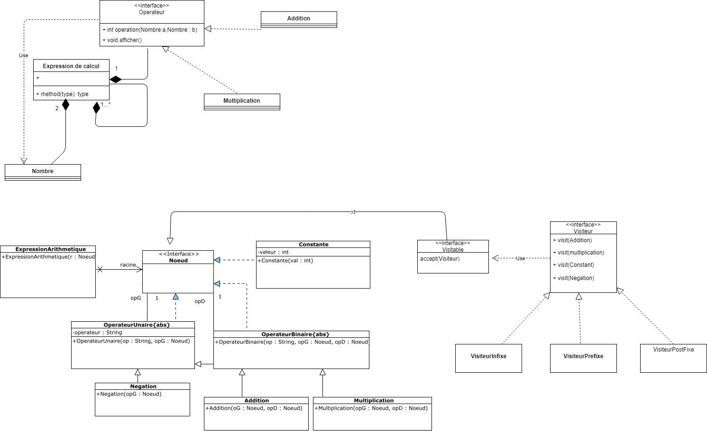

**Nom/Prénom Etudiant 1 :**

**Nom/Prénom Etudiant 2 :**

# Rapport TP2

## Question 1
*Insérer un schéma du patron de conception mis en place*
Expliquer le pattern avec un schéma
On utilise le pattern Visiteur


## Question 2
*Expliquer le code ajouté*
On a crée une interface Visiteur où l'on implémente une méthode visit avec comme paramètre les différentes opérations
```JAVA
    public void visit(Multiplication multiplication);
    public void visit(Addition addition);
    public void visit(Constante constante);
    public void visit(Negation negation);
```
On a crée une interface Visitable avec la méthode accept qui prend en paramètre un visiteur 
```JAVA
    public void accept(Visiteur visiteur);
```
On fait hériter l'interface Noeud de l'interface Visitiable
```JAVA
public interface Noeud extends Visitable{}
```

On fait définit dans chaque classe d'opération arithmétique
```JAVA
	public void accept(Visiteur visiteur) {
		visiteur.visit(this);
	}
```

**On remarque que les méthodes visit pour les additions et les multiplications sont les mêmes donc nous préfèrons modifiers les méthodes visit**
```JAVA
	public void visit(OperateurBinaire operateurBinaire);
```

## Question 3
*Expliquer le code ajouté*
Lorsque l'on trouve une constante, on imprime sa valeur  
```JAVA
    public void visit(Constante constante) {
        System.out.print(constante.getValeur());
    }
```
Pour une négation, on visite sa constante et on imprime son opérateur (le "-" ici) 
```JAVA
    public void visit(Negation negation) {
        negation.getOpG().accept(this);
        System.out.print(negation.getOp());
    }
```
Comme l'addition et la multiplication ont la même logique, on crée une méthode visiBinaire
```JAVA
    public void visitBinaire(OperateurBinaire operateurBinaire) {
        operateurBinaire.getOpG().accept(this);
        operateurBinaire.getOpD().accept(this);
        System.out.print(operateurBinaire.getOp());
    }

    public void visit(Addition addition) {
        visitBinaire(addition);
    }

    public void visit(Multiplication multiplication) {
        visitBinaire(multiplication);
    }
```

## Question 4
*Expliquer le code ajouté*
On fait une nouvelle classe visiteur qui va calculer l'expression. On la fait hérité de la classe VisiteurPostFixe car le parcours correspond le mieux.  
```JAVA
public class VisiteurCalcul extends VisiteurPostfixe{
```

Pour les opérateurs binairs, on crée une fonction getLeft(). Cette fonction va parcourir la partie gauche du noeud, stocké sa valeur  
parcourir la partie droite du noeud et renvoyé sa valeur
```JAVA
    private int getLeft(OperateurBinaire operateurBinaire) {
        operateurBinaire.getOpG().accept(this);
        int left = this.valeur;
        operateurBinaire.getOpD().accept(this);
        return left;
    }
```
Ensuite on récupère cette valeur et on applique l'opérateur à sa valeur droite
```JAVA
    @Override
    public void visit(Addition addition) {
        int left = getLeft(addition);
        this.valeur += left;
    }
    
    @Override
        public void visit(Multiplication multiplication) {
            int left = getLeft(multiplication);
            this.valeur *= left;
        }
```
## Question 5
*Expliquer le code ajouté*
On crée un nouveau visiteur qui va calculer la hauteur qui va hériter de la classe VisiteurPrefixe.
```JAVA
public class VisiteurHauteur extends VisiteurPrefixe {
```
On surcharge la méthode visitBinaire où l'on incrémente de la hauteur à chaque fois qu'un niveau est parcouru 
```JAVA
@Override
    public void visitBinaire(OperateurBinaire operateurBinaire) {
        super.visitBinaire(operateurBinaire);
        hauteur += 1;
    }
```
## Question 6
*Expliquer le code ajouté*